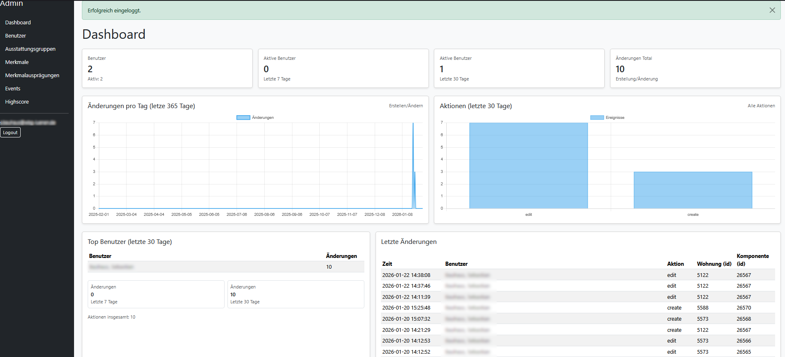
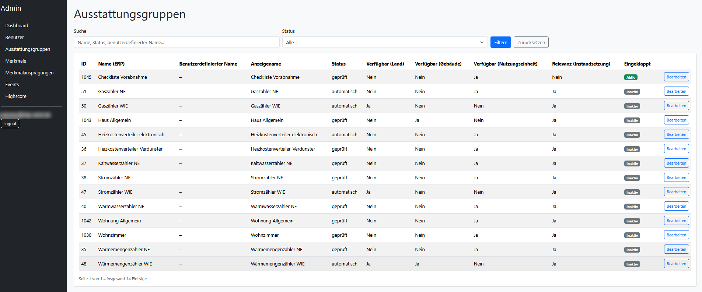
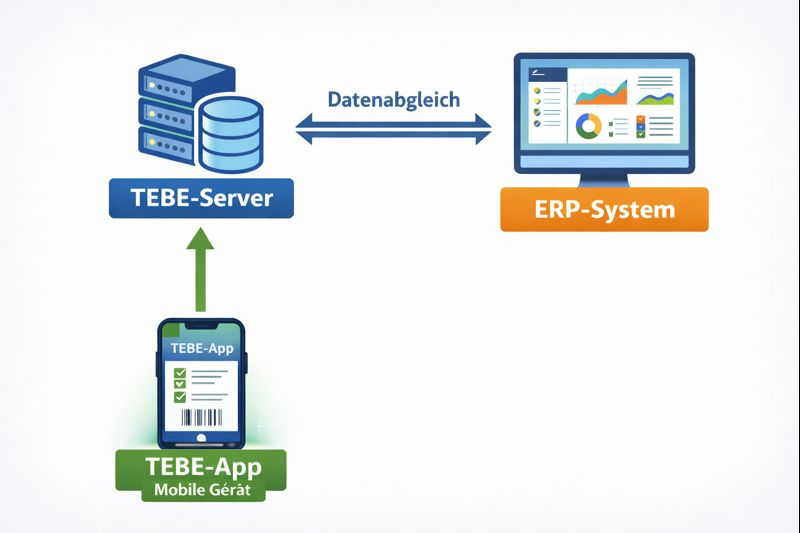
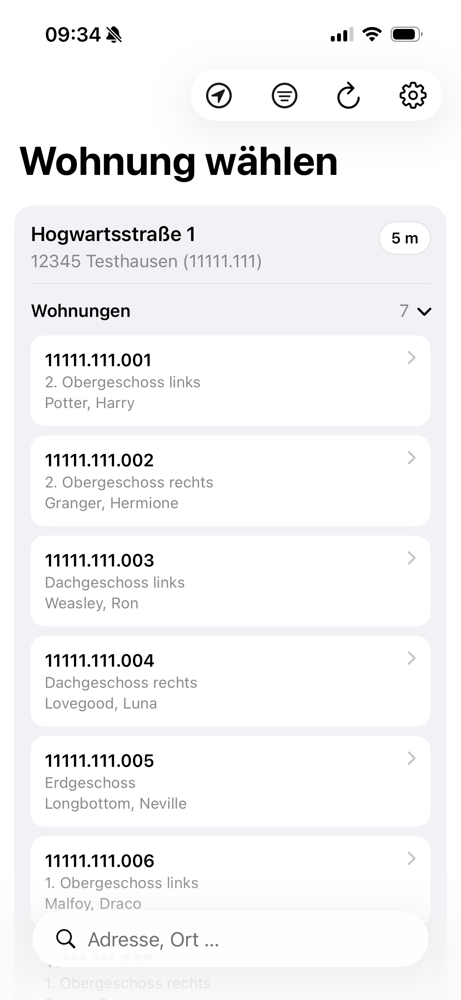
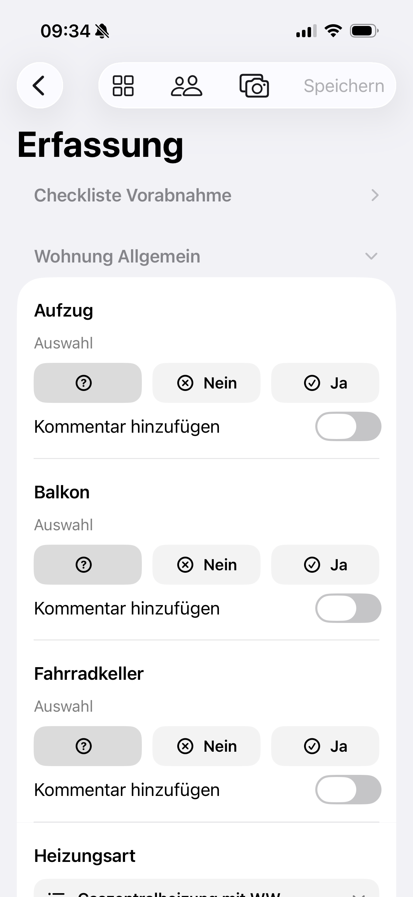

# TEBE-Server
### Strukturierte Erfassung des technischen Bestands per App

|  |  |
|----------------------------------|----------------------------------|

#### Was ist der TEBE-Server?
Zusammen mit der zugehörigen App für mobile Geräte (erhältlich für iPhone/iPad) können
Mitarbeiter im Außendienst übersichtlich und schnell die technischen Bestandsdaten im
 ERP-System pflegen. Die Screenshots oben zeigen die administrative Oberfläche. Hier 
kann eingestellt werden, wie sich Merkmale verhalten und welche in der App erscheinen sollen.
Screenshots zur App finden sich weiter unten

#### Architektur
Sie verbinden den TEBE-Server mit dem ERP-System Ihrer Wahl. Im TEBE-Server
 legen Sie Benutzer an, die per App zugreifen können und bestimmen, welche Merkmale und Komponenten
 diese sehen und bearbeiten können. Der Abgleich mit dem ERP-System erfolgt direkt, also 
ohne Verzögerung zum ERP-System.  

#### iOS-App
Screenshots:

|  |  |
|----------------------|------------------------|

#### Installation
* Repository klonen
* config.ini.example zu config.ini kopieren und entsprechende Einstellungen tätigen
* venv anlegen und requirements.txt per pip installieren
* Server wie uwsgi starten. z.B. via uwsgiconfig_example.ini